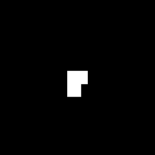

# [Solar Panel Detection Using Sentinel-2](https://solafune.com/competitions/5dfc315c-1b24-4573-804f-7de8d707cd90?menu=about&tab=&topicId=1143a379-29c4-415e-aeb4-fc761ce9b243)

### this solution got me passed `F1-wise 0.607` (higher is better) and `10, 13 place` on Public, Private LeaderBoard respectively [here](https://solafune.com/competitions/5dfc315c-1b24-4573-804f-7de8d707cd90?menu=lb&tab=public&topicId=1143a379-29c4-415e-aeb4-fc761ce9b243) as name as `bitGuber`

<h2>Raw Image &nbsp;&nbsp;&nbsp;&nbsp;&nbsp;&nbsp;&nbsp;&nbsp;&nbsp;&nbsp;&nbsp;&nbsp;&nbsp;&nbsp;&nbsp;&nbsp;&nbsp;&nbsp;&nbsp;&nbsp;&nbsp;&nbsp;&nbsp;&nbsp;&nbsp;&nbsp;&nbsp;Prediction&nbsp;&nbsp;&nbsp;&nbsp;&nbsp;&nbsp;&nbsp;&nbsp;&nbsp;&nbsp;&nbsp;&nbsp;&nbsp;&nbsp;&nbsp;&nbsp;&nbsp;&nbsp;&nbsp;&nbsp;&nbsp;&nbsp;&nbsp;&nbsp;&nbsp;&nbsp;&nbsp;&nbsp;&nbsp;&nbsp;&nbsp; TrueMask</h2>

 
 

  

## Problem Overview
In recent years, the installation of solar panels has increased as renewable energy sources have become more prevalent. Knowing the exact location and footprint of these panels is crucial for energy supply planning, infrastructure optimization, and disaster prediction.
Optical satellite imagery is well suited for solar panel detection because of its ability to observe large areas at once. This competition aims to develop a technique for accurately segmenting pixels with solar panels from Sentinel-2 optical satellite images, which have relatively low resolution.

## Goal of the Competition
Detecting solar panels from low-resolution satellite images,

We hope that participants will rise to the challenge and develop new technologies that will contribute not only to the detection of solar panels, but also to more efficient energy use.

## My Solution

This Repo contains reproduce code only that used to trained and submission for competition.

- save_model_[ 1, 2,..5 ].h5 ( tensorflow trained model  )
- utils.py ( which contains preprocess steps )
- train.py ( optimal training python code )
- requirements.txt ( necessary packages for solution )

 
there few NLP Feature engineering and Gradient Boosting model that help my solution.
